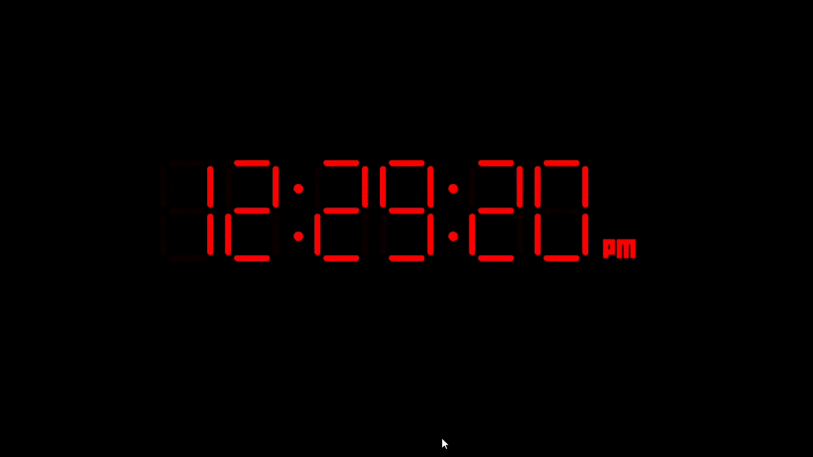

# Digital Clock

This Animation is made in C++ using SFML(Simple and Fast Multimedia Library) which is a graphics library that is generally used for 2d Game_Development.

## Animation

## Building

You will need SFML 2.5+ and a compiler that supports C++11 or above.

I would recommend that you build the SFML from source using Cmake rather than Downloading the RELEASE because it requires a perfect match of compiler version with the library version.

Here's how you can do it : https://youtu.be/ttYspMwzV8w

After setting up the library run "mingw32-make run" command from cmd,powershell or bash.

If there is an error related to font , change the font path in the 36th line of Main.cpp
